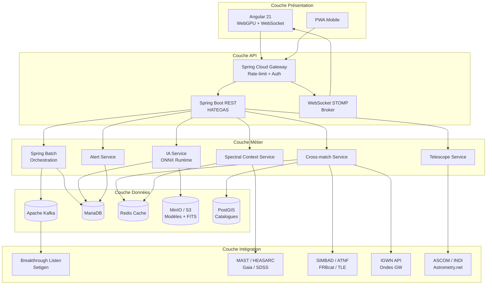
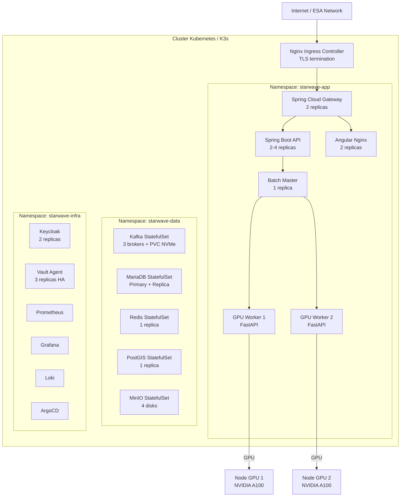
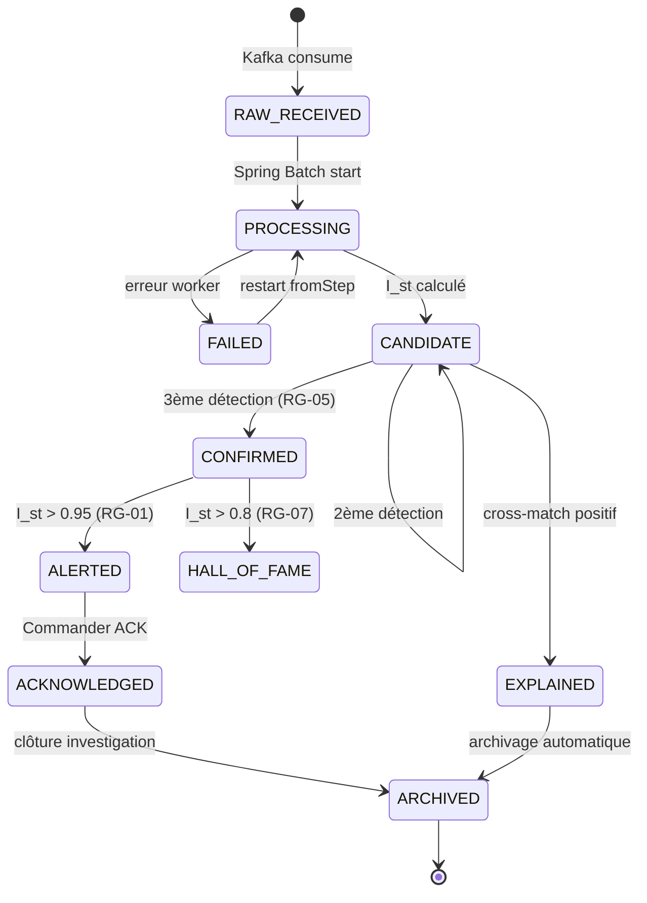
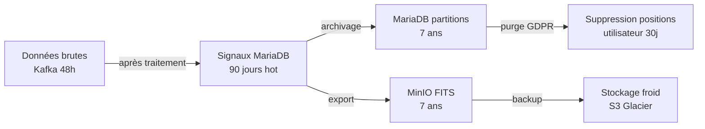
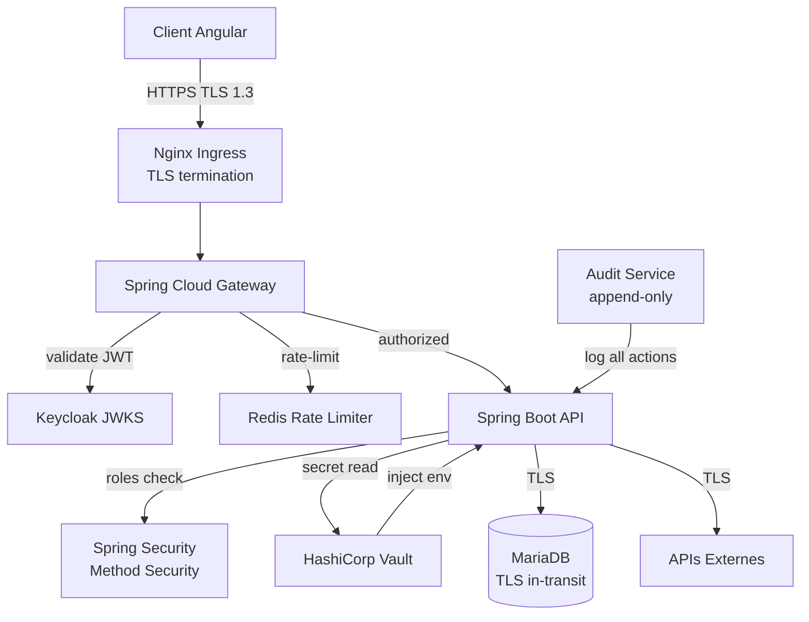
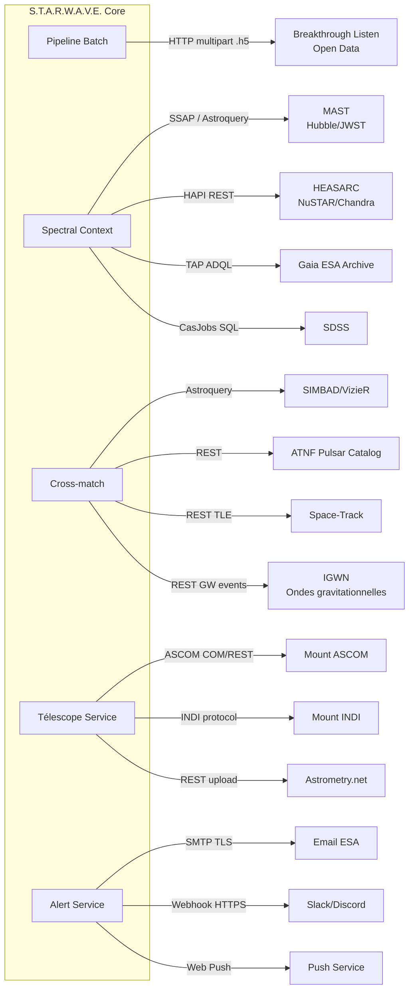
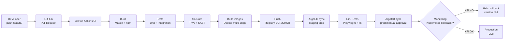
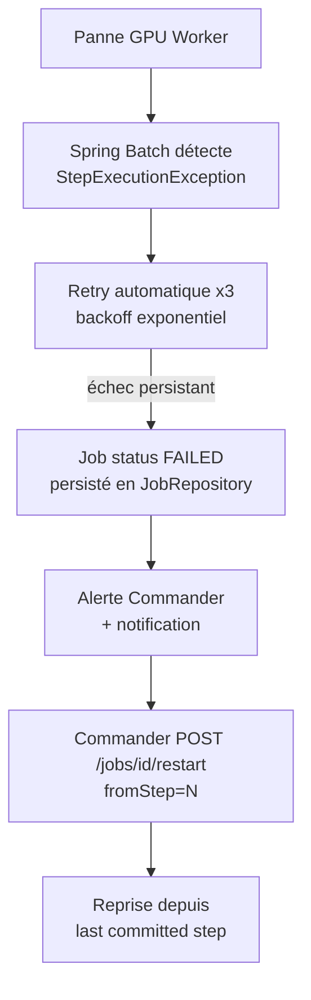

# 🏗️ DAT — Dossier d'Architecture Technique
## S.T.A.R.W.A.V.E. — SETI Tracking & Analysis of Radio Waves for ESA

**Version :** 1.1  
**Statut :** Validé pour implémentation  
**Auteur :** Lead Solution Architect  
**Classification :** Confidentiel ESA

---

## Sommaire

1. [Contexte & Objectifs Architecturaux](#1-contexte--objectifs-architecturaux)
2. [Contraintes & Décisions d'Architecture (ADR)](#2-contraintes--décisions-darchitecture-adr)
3. [Architecture Logique](#3-architecture-logique)
4. [Architecture Physique & Infrastructure](#4-architecture-physique--infrastructure)
5. [Architecture Applicative détaillée](#5-architecture-applicative-détaillée)
6. [Architecture des Données](#6-architecture-des-données)
7. [Architecture de Sécurité](#7-architecture-de-sécurité)
8. [Architecture d'Intégration](#8-architecture-dintégration)
9. [Architecture de Déploiement (IaC)](#9-architecture-de-déploiement-iac)
10. [Plan de Continuité & Résilience](#10-plan-de-continuité--résilience)
11. [Risques Architecturaux](#11-risques-architecturaux)

---

## 1. Contexte & Objectifs Architecturaux

### 1.1 Contexte

S.T.A.R.W.A.V.E. est une plateforme de traitement intensif de données radioastronomiques à destination de l'ESA. Elle doit ingérer, traiter et analyser des téraoctets de données radio brutes provenant de télescopes distribués afin de détecter des signatures technologiques non-humaines. Le système fonctionne en environnement critique (99,9 % de disponibilité requise) et doit rester extensible à de nouvelles sources de données et de nouveaux modèles IA.

### 1.2 Attributs de Qualité (Quality Attributes)

| Attribut | Exigence | Priorité |
|---|---|---|
| **Performance** | 1 To traité en < 60 min, inférence IA < 2 ms | Critique |
| **Disponibilité** | 99,9 % uptime système de monitoring | Critique |
| **Scalabilité** | Ajout dynamique de workers GPU sans interruption | Haute |
| **Sécurité** | Authentification JWT, chiffrement TLS, RBAC granulaire | Critique |
| **Maintenabilité** | Modules indépendants, GitOps, tests automatisés | Haute |
| **Observabilité** | Métriques, logs structurés, traces distribuées | Haute |
| **Interopérabilité** | HATEOAS, formats ouverts FITS, JSON, XML | Haute |
| **Confidentialité (GDPR)** | Géolocalisation opt-in, audit trail complet | Critique |

---

## 2. Contraintes & Décisions d'Architecture (ADR)

### ADR-01 : Spring Batch pour le traitement par lots

**Contexte :** Le traitement des signaux radio est intrinsèquement un traitement par lots (1 To par campagne d'observation).  
**Décision :** Utiliser Spring Batch 5.x avec Java 25 Virtual Threads.  
**Justification :** Gestion native de la reprise sur incident (JobRepository), partitioning Master/Worker éprouvé, intégration naturelle avec l'écosystème Spring (Security, HATEOAS, AI).  
**Conséquences :** Nécessite MariaDB pour le JobRepository ; les Virtual Threads évitent de dimensionner un pool de threads OS pour les partitions.

### ADR-02 : Calcul FFT déporté sur GPU via FastAPI/CuPy

**Contexte :** La FFT sur des trames de 32K points répétée des millions de fois est prohibitive sur CPU.  
**Décision :** Déporter les calculs intensifs (FFT, Deep-Drift Hough inversée, features) sur un service FastAPI Python avec CuPy.  
**Justification :** CuPy offre une API NumPy-compatible sur CUDA ; FastAPI permet de l'exposer via REST sans friction. Spring Batch appelle ce service de manière asynchrone.  
**Conséquences :** Couplage réseau entre JVM et GPU worker ; nécessite NVIDIA Container Toolkit sur les nœuds GPU.

### ADR-03 : Modèles IA embarqués ONNX dans la JVM

**Contexte :** Appeler Python pour chaque inférence introduit une latence réseau incompatible avec la cible < 2 ms.  
**Décision :** Exporter les modèles PyTorch en ONNX et les embarquer dans la JVM via Spring AI (ONNX Runtime Java).  
**Justification :** Élimine le saut réseau pour l'inférence. ONNX Runtime supporte l'accélération CPU/GPU en JVM.  
**Conséquences :** Modèles de taille raisonnable (<500 Mo) pour éviter la pression mémoire JVM ; hot-swap via S3/MinIO sans redémarrage.

### ADR-04 : Apache Kafka comme bus d'événements d'ingestion

**Contexte :** Les télescopes émettent des flux continus pouvant varier fortement en débit.  
**Décision :** Utiliser Apache Kafka comme buffer élastique entre les sources et le pipeline Batch.  
**Justification :** Découplage producteur/consommateur, replay possible, partition naturelle par plage de fréquences.  
**Conséquences :** Complexité opérationnelle Kafka (ZooKeeper/KRaft, topics, consumer groups) ; StatefulSet Kubernetes avec PVC NVMe.

### ADR-05 : WebGPU pour le rendu Waterfall

**Contexte :** Le Waterfall affiche des millions de points par seconde. Canvas 2D / WebGL ne suffisent pas.  
**Décision :** Utiliser l'API WebGPU (W3C) avec compute shaders WGSL pour le mapping amplitude → couleur.  
**Justification :** WebGPU offre un accès direct au GPU du client sans plugin ; support Chrome 113+, Edge 113+, Firefox (flag).  
**Conséquences :** Compatibilité navigateur à vérifier ; fallback WebGL 2 prévu pour les navigateurs sans WebGPU.

### ADR-06 : MariaDB comme base de données principale

**Contexte :** Les données de signaux sont structurées et transactionnelles (Spring Batch JobRepository).  
**Décision :** MariaDB (InnoDB) pour les signaux, alertes, jobs. Extension PostGIS pour les requêtes spatiales du cross-match.  
**Justification :** Maturité, compatibilité MySQL, support natif Spring Batch, PostGIS pour les cone-search astronomiques.  
**Conséquences :** Déploiement StatefulSet K8s avec PVC ; backup automatique via CronJob.

### ADR-07 : HashiCorp Vault pour la gestion des secrets

**Contexte :** Clés API NASA/ESA/IGWN, tokens Keycloak, credentials DB, clé de signature PDF.  
**Décision :** HashiCorp Vault avec Vault Agent Injector Kubernetes.  
**Justification :** Rotation automatique des secrets, audit trail, injection transparente dans les pods.  
**Conséquences :** Dépendance à Vault ; en cas de panne Vault, les pods ne peuvent pas démarrer.

---

## 3. Architecture Logique



---

## 4. Architecture Physique & Infrastructure

### 4.1 Topologie des Nœuds Kubernetes



### 4.2 Spécifications des Nœuds

| Type de nœud | CPU | RAM | Stockage | GPU | Rôle |
|---|---|---|---|---|---|
| Control Plane | 4 vCPU | 8 Go | 100 Go SSD | — | Kubernetes master |
| App Workers | 8 vCPU | 32 Go | 200 Go SSD | — | API, Gateway, Frontend |
| GPU Workers | 16 vCPU | 64 Go | 2 To NVMe | NVIDIA A100 40Go | FFT, IA |
| Data Nodes | 8 vCPU | 32 Go | 4 To NVMe | — | Kafka, MariaDB, MinIO |
| Infra Nodes | 4 vCPU | 16 Go | 200 Go SSD | — | Keycloak, Vault, Monitoring |

### 4.3 Réseau

- **Ingress :** Nginx Ingress Controller avec TLS Let's Encrypt (cert-manager).
- **Service Mesh :** Cilium CNI avec Network Policies strictes (deny-all par défaut).
- **GPU Network :** SR-IOV ou accès host-network pour les workers GPU si latence critique.
- **DNS interne :** CoreDNS Kubernetes.

---

## 5. Architecture Applicative Détaillée

### 5.1 Spring Boot — Structure des packages

```
com.esa.starwave
├── batch
│   ├── config          // JobConfiguration, StepConfiguration, Partitioner
│   ├── reader          // KafkaItemReader, BlH5ItemReader
│   ├── processor       // SignalValidator, FFTProcessor, IstCalculator
│   └── writer          // SignalItemWriter, AlertTriggerWriter
├── ai
│   ├── onnx            // OnnxModelService (Spring AI)
│   ├── xai             // ShapExplainer
│   └── crossmatch      // CrossMatchService, CatalogueRepository
├── api
│   ├── controller      // SignalController, JobController, TelescopeController
│   ├── hateoas         // SignalModelAssembler, JobModelAssembler
│   └── dto             // SignalDto, SpectrumDto, JobStatusDto
├── websocket
│   ├── config          // WebSocketConfig (STOMP)
│   └── handler         // WaterfallStreamHandler, AlertBroadcaster
├── alert
│   ├── service         // AlertService, RulesEngine
│   └── channel         // EmailChannel, SlackChannel, PushChannel
├── security
│   ├── config          // SecurityConfig (OAuth2 Resource Server)
│   └── jwt             // JwtUserConverter
├── telescope
│   ├── service         // TelescopeService, SafetyChecker
│   └── driver          // AscomDriver, IndiDriver
└── monitoring
    └── metrics         // StarwaveMetrics (Micrometer)
```

### 5.2 Cycle de vie d'un signal — Diagramme d'état



---

## 6. Architecture des Données

### 6.1 Stratégie de partitionnement

- **Signaux actifs (< 90 jours) :** MariaDB InnoDB, hot storage NVMe.
- **Signaux archivés (> 90 jours) :** partitionnement par mois (`PARTITION BY RANGE YEAR-MONTH`), cold storage.
- **Données spectrales FITS :** stockées dans MinIO (S3-compatible), référencées par URL dans la table signal.
- **Catalogues astronomiques :** PostGIS avec index spatial GIST, refresh hebdomadaire via CronJob.

### 6.2 Flux de données & rétention



### 6.3 Cohérence & Transactions

- **Transactions ACID :** toutes les écritures signal + provenance + alerte dans une transaction Spring `@Transactional`.
- **Idempotence Kafka :** clé de message = `(telescope_id, timestamp, freq_partition)` pour éviter les doublons.
- **Outbox Pattern :** les alertes sont d'abord écrites en table `alert_outbox` dans la même transaction, puis relues par le Alert Service, garantissant la cohérence signal ↔ alerte.

---

## 7. Architecture de Sécurité

### 7.1 Modèle de menaces (STRIDE)

| Menace | Surface | Contre-mesure |
|---|---|---|
| **Spoofing** | API REST | JWT Keycloak, TLS mutuel |
| **Tampering** | Base de données | RBAC, audit trail, hash des modèles ONNX |
| **Repudiation** | Actions Commander | Journal immuable (append-only audit log) |
| **Information Disclosure** | Géolocalisation | Opt-in GDPR, anonymisation hash |
| **Denial of Service** | API publique | Rate-limiting Gateway, circuit-breaker Resilience4j |
| **Elevation of Privilege** | Roles Keycloak | RBAC strict, revue trimestrielle des accès |

### 7.2 Flux de sécurité complet



### 7.3 Gestion des données personnelles (GDPR)

| Donnée | Type | Rétention | Suppression |
|---|---|---|---|
| Position GPS (session-only) | Éphémère | 0 (mémoire session) | À déconnexion |
| Position GPS (profil) | Persistée | 30 jours | Sur demande utilisateur |
| Position GPS (anonymisée) | Hash SHA-256 | 1 an | Automatique |
| Journal actions utilisateur | Audit | 3 ans | Non supprimable (audit) |
| Nom d'utilisateur | Profil | Durée du compte | Sur suppression compte |

---

## 8. Architecture d'Intégration

### 8.1 Carte des intégrations externes



### 8.2 Résilience des intégrations externes

| Intégration | Pattern de résilience | Fallback |
|---|---|---|
| MAST / HEASARC / Gaia | Circuit Breaker (Resilience4j) + Retry x3 | Cache Redis TTL 24h |
| SIMBAD / ATNF | Circuit Breaker + Cache PostGIS local | Catalogue local (refresh J-1) |
| Space-Track TLE | Scheduled refresh 6h | TLE précédent en cache |
| IGWN API | Retry x3 + timeout 5s | Signal non corrélé, label non modifié |
| Mount ASCOM/INDI | Timeout 10s + safety check | Slew annulé + notification |
| Astrometry.net | Timeout 30s | Centrage annulé, position estimée |

---

## 9. Architecture de Déploiement (IaC)

### 9.1 Structure des dépôts Git

```
starwave-platform/
├── infrastructure/
│   ├── terraform/
│   │   ├── modules/
│   │   │   ├── k8s-cluster/      # Provisioning K8s / K3s
│   │   │   ├── gpu-nodes/        # Nœuds GPU NVIDIA
│   │   │   └── storage/          # PVCs NVMe
│   │   └── envs/
│   │       ├── dev/
│   │       ├── staging/
│   │       └── prod/
│   ├── ansible/
│   │   ├── playbooks/
│   │   │   ├── nvidia-toolkit.yml
│   │   │   └── post-provisioning.yml
│   └── helm/
│       ├── starwave-app/         # Chart principal
│       ├── starwave-data/        # Kafka, MariaDB, Redis
│       └── starwave-infra/       # Keycloak, Vault, Monitoring
├── apps/
│   ├── backend/                  # Spring Boot (multi-module Maven)
│   ├── gpu-worker/               # FastAPI Python
│   ├── frontend/                 # Angular 21
│   ├── crossmatch-service/       # Python Astroquery
│   └── spectral-context/         # Python Astroquery async
└── gitops/
    ├── argocd/
    │   ├── apps/                 # ArgoCD Application CRDs
    │   └── projects/
    └── kustomize/
        ├── base/
        ├── overlays/dev/
        ├── overlays/staging/
        └── overlays/prod/
```

### 9.2 Pipeline CI/CD



### 9.3 Commandes IaC de référence

```bash
# Provisioning d'un nouveau site d'écoute
terraform -chdir=infrastructure/terraform/envs/prod apply \
  -var="site=orion-station-01" \
  -var="gpu_count=2"

# Déploiement applicatif
helm upgrade --install starwave ./infrastructure/helm/starwave-app \
  -f infrastructure/helm/starwave-app/values-prod.yaml \
  --set image.tag=$(git rev-parse --short HEAD) \
  -n starwave-app

# Synchronisation GitOps
argocd app sync starwave-prod --force
```

---

## 10. Plan de Continuité & Résilience

### 10.1 Objectifs de reprise

| Scénario | RTO (Recovery Time) | RPO (Recovery Point) |
|---|---|---|
| Crash pod applicatif | < 30 secondes | 0 (Kubernetes restart) |
| Panne nœud GPU | < 5 minutes | 0 (reprise step Batch) |
| Panne MariaDB primary | < 2 minutes | 0 (réplica synchrone) |
| Panne datacenter | < 30 minutes | < 5 minutes (backup S3) |
| Corruption de données | < 4 heures | < 1 heure (backup horaire) |

### 10.2 Mécanismes de résilience



**Resilience4j — Configuration des Circuit Breakers :**

```yaml
resilience4j:
  circuitbreaker:
    instances:
      mast-api:
        slidingWindowSize: 10
        failureRateThreshold: 50
        waitDurationInOpenState: 30s
        permittedNumberOfCallsInHalfOpenState: 3
      simbad-api:
        slidingWindowSize: 10
        failureRateThreshold: 60
        waitDurationInOpenState: 60s
  retry:
    instances:
      external-apis:
        maxAttempts: 3
        waitDuration: 2s
        enableExponentialBackoff: true
```

### 10.3 Sauvegarde & Restauration

| Composant | Fréquence | Outil | Destination |
|---|---|---|---|
| MariaDB (full) | Quotidien 02h00 | mysqldump + CronJob K8s | MinIO + S3 Glacier |
| MariaDB (incrémental) | Toutes les heures | Binlog streaming | MinIO |
| PostGIS catalogues | Hebdomadaire | pg_dump | MinIO |
| MinIO (FITS + modèles) | Synchronisation continue | mc mirror | S3 Glacier |
| Secrets Vault | Quotidien | vault operator export | S3 chiffré |
| Configuration K8s | Git-natif | ArgoCD GitOps | GitHub |

---

## 11. Risques Architecturaux

| ID | Risque | Probabilité | Impact | Mitigation |
|---|---|---|---|---|
| R-01 | Saturation GPU lors de pics de données (Solar Maxima) | Moyenne | Élevé | Auto-scaling K8s + queue Kafka comme buffer élastique |
| R-02 | Indisponibilité API externes (MAST, SIMBAD) | Haute | Moyen | Circuit breaker + cache local PostGIS + fallback |
| R-03 | Dérive du modèle IA (concept drift) sur nouveaux types de signaux | Moyenne | Élevé | Pipeline MLOps avec détection drift (PSI) + alerte réentraînement |
| R-04 | Faux positif Premier Contact (alerte ESA non fondée) | Basse | Critique | Règle RG-05 (3 confirmations) + validation Analyst avant alerte externe |
| R-05 | Violation GDPR sur géolocalisation | Basse | Critique | Opt-in strict, purge automatique 30j, audit trail |
| R-06 | Perte de connexion WebSocket sur sessions longues | Haute | Moyen | SockJS fallback + reconnexion automatique + cache local 5 min |
| R-07 | Incompatibilité driver mount télescope (ASCOM/INDI versions) | Moyenne | Moyen | Abstraction driver + tests avec simulateur ASCOM |
| R-08 | Taille modèle ONNX croissante → pression mémoire JVM | Basse | Moyen | Limite 500 Mo, quantification INT8, monitoring heap JVM |

---

*Fin du DAT — S.T.A.R.W.A.V.E. v1.1*  
*Document soumis à révision trimestrielle par le Comité d'Architecture ESA.*
