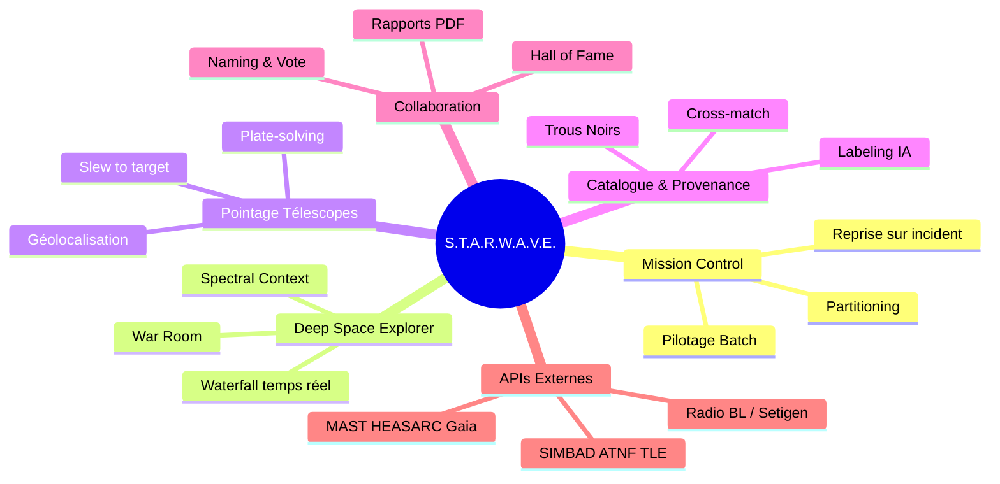
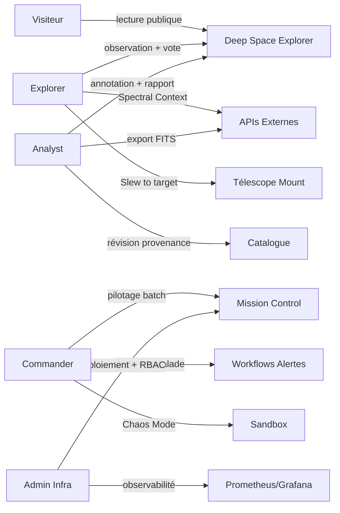
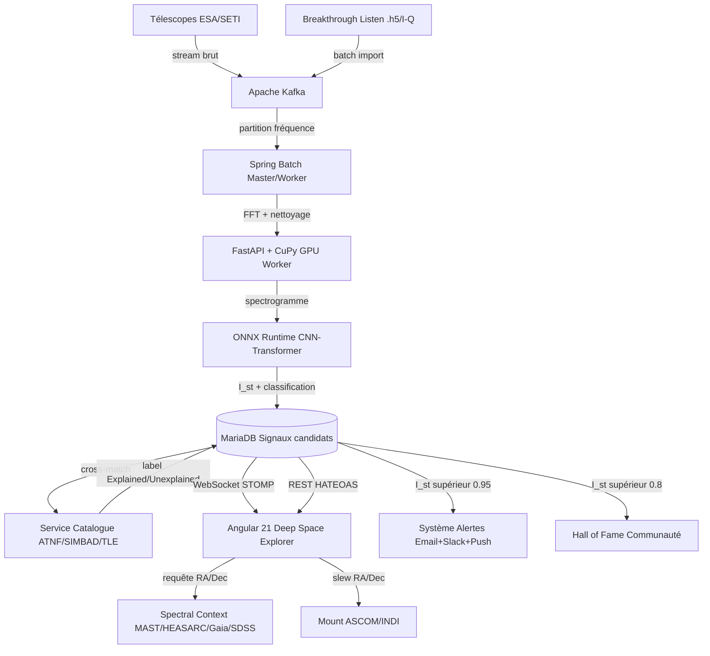
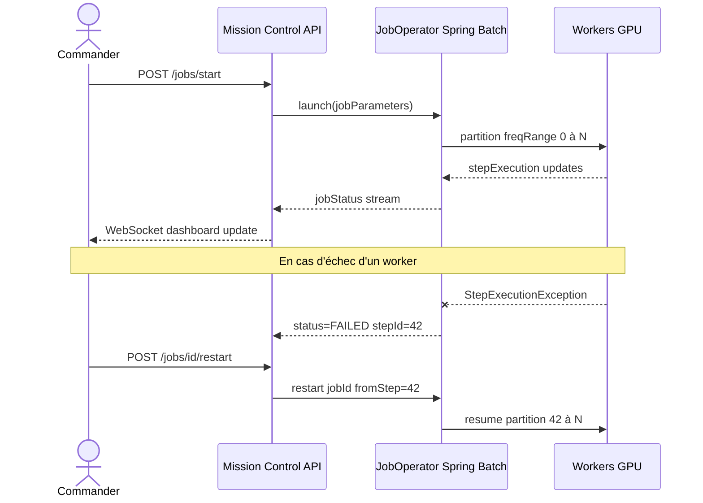
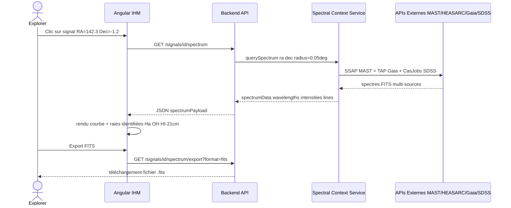
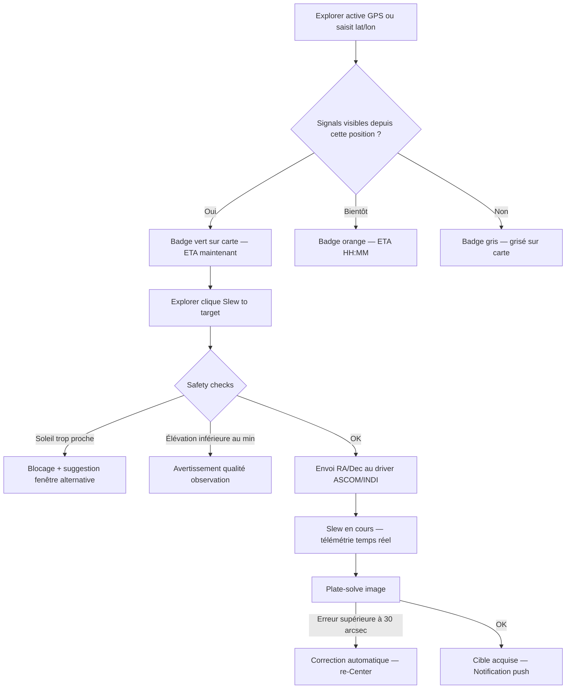
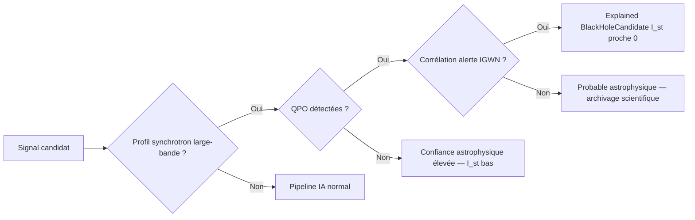
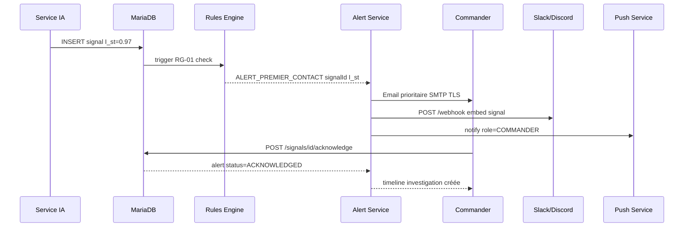
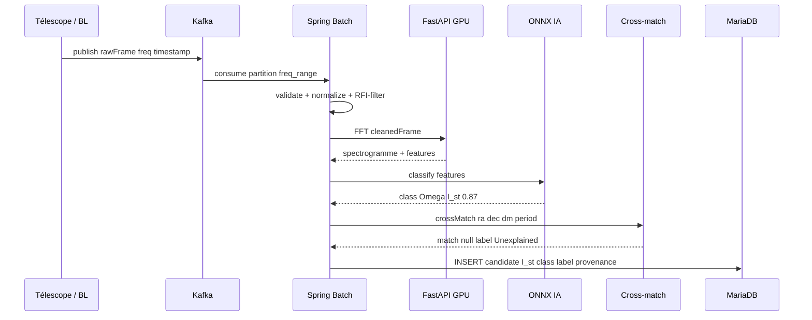

# 📋 Spécifications Fonctionnelles — S.T.A.R.W.A.V.E.

## SETI Tracking & Analysis of Radio Waves for ESA

---

## Sommaire

1. [Périmètre fonctionnel](#1-périmètre-fonctionnel)
2. [Acteurs & Rôles](#2-acteurs--rôles)
3. [Flux de données global](#3-flux-de-données-global)
4. [Cas d'usage détaillés par module](#4-cas-dusage-détaillés-par-module)
5. [Diagrammes de séquence](#5-diagrammes-de-séquence)
6. [Règles de gestion](#6-règles-de-gestion)
7. [Maquettes fonctionnelles](#7-maquettes-fonctionnelles)
8. [Matrice de traçabilité US ↔ Modules](#8-matrice-de-traçabilité)

---

## 1. Périmètre Fonctionnel

S.T.A.R.W.A.V.E. couvre six domaines fonctionnels :

---

## 2. Acteurs & Rôles

| Rôle | Périmètre |
|---|---|
| **Visiteur** | Lecture Waterfall, Hall of Fame, Fermi Score (non authentifié) |
| **Explorer** | Tout Visiteur + filtres géoloc, Spectral Context, Slew to target, vote naming |
| **Analyst** | Tout Explorer + annotation, révision provenance, rapport PDF, export FITS |
| **Commander** | Tout Analyst + contrôle batch, configuration IA, Chaos Mode, alertes prioritaires |
| **Admin Infra** | Tout Commander + déploiement, RBAC Keycloak, observabilité Grafana |

---

## 3. Flux de Données Global

---

## 4. Cas d'Usage Détaillés par Module

### 4.1 Mission Control — Pilotage Batch

**Préconditions :** rôle Commander ou Admin, token JWT Keycloak valide.  
**Postconditions :** job terminé → signaux candidats inscrits en base, métriques Micrometer émises.  
**Cas d'erreur :** échec réseau → retry automatique x3, puis alerte Commander.

---

### 4.2 Deep Space Explorer — Waterfall & Spectral Context

**UC-DSE-01 : Visualisation Waterfall temps réel**

Précondition : Explorer authentifié, job batch en cours.

1. Le backend pousse les frames FFT via WebSocket STOMP (`/topic/waterfall`).
2. Angular reçoit le flux et le rendu WebGPU met à jour le canvas à 60 fps.
3. L'utilisateur clique sur une anomalie → ouverture du modal Radar Chart (bande passante, Doppler, régularité).
4. Le modal expose les actions HATEOAS : `reanalyze`, `archive`, `view-on-sky-map`.

**UC-DSE-02 : Spectral Context**

Précondition : signal sélectionné avec coordonnées RA/Dec.

**UC-DSE-03 : Replay & Time Travel**

L'Explorer sélectionne une plage temporelle dans l'historique → lecture frame par frame avec curseur de vitesse (0.5×, 1×, 2×). Possibilité d'ajouter un bookmark horodaté et une annotation textuelle.

---

### 4.3 Pointage Télescopes & Géolocalisation

---

### 4.4 Catalogue & Phénomènes Expliqués

**UC-CAT-01 : Cross-match automatique**

Après chaque détection (post-FFT), le pipeline déclenche le service de cross-match :

1. Calcul séparation angulaire avec tous les objets ATNF / SIMBAD / TLE dans un cone de 0.5°.
2. Si séparation < seuil_confiance → étiquetage `Explained: <type>`.
3. FRB : vérification concordance DM (±10 pc/cm³).
4. Pulsars : vérification période (±5 ms).
5. Résultat stocké avec provenance complète (catalogue, identifiant, séparation, version index).

**UC-CAT-02 : Détection signature Trou Noir**

---

### 4.5 Module Collaboratif — SETI @ Community

**UC-COM-01 : Hall of Fame**

Condition : $I_{st} > 0.8$ ET signal validé (3 détections répétées).  
Flux : publication automatique → notification communautaire → vote de naming (7 jours) → nom validé par Commander → rapport PDF générable via `POST /signals/{id}/generate-report`.

**UC-COM-02 : Rapport PDF certifié**

1. Analyst ou Commander appelle l'action HATEOAS `generate-report`.
2. Backend compile : métadonnées signal, spectre, Radar Chart, historique cross-match, $I_{st}$ avec explicabilité.
3. Signature numérique ESA apposée (clé privée Vault).
4. PDF téléchargeable + lien HATEOAS permanent dans la réponse.

---

## 5. Diagrammes de Séquence

### 5.1 Flux "Alerte Premier Contact" (RG-01)

### 5.2 Flux d'Ingestion Complète (US-01 à US-05)

---

## 6. Règles de Gestion

| ID | Règle | Déclencheur | Action |
|---|---|---|---|
| RG-01 | $I_{st} > 0.95$ | Post-classification IA | Alerte Premier Contact (Email + Slack + Push) |
| RG-02 | Signal classé "Technologique" | Post RG-01 | Activation analyse de sentiment |
| RG-03 | Chaos Monkey activé | Manuel (sandbox) | Injection panne simulée RFI / worker crash |
| RG-04 | Accès endpoints sensibles | Toute requête API | Vérification JWT Keycloak, refus 401 sinon |
| RG-05 | 3 détections répétées même profil | Pipeline validation | Statut candidat → `CONFIRMED` |
| RG-06 | Séparation angulaire < seuil_type | Cross-match positif | Étiquetage `Explained: <type>` |
| RG-07 | $I_{st} > 0.8$ + statut CONFIRMED | Publication | Entrée automatique Hall of Fame |
| RG-08 | Slew avec soleil < 15° | Safety check | Blocage + proposition fenêtre alternative |
| RG-09 | Erreur plate-solve > 30″ | Post-slew | Re-centrage automatique (max 3 tentatives) |
| RG-10 | Job batch en échec > 3 retries | JobOperator | Notification Commander + statut FAILED persisté |

---

## 7. Maquettes Fonctionnelles

### 7.1 Dashboard War Room

### 7.2 Modal Signal — Radar Chart + Spectral Context

---

## 8. Matrice de Traçabilité

| Module | US couverts | Règles |
|---|---|---|
| Mission Control | US-09, US-16, US-18, US-39, US-40 | RG-03, RG-04, RG-10 |
| Deep Space Explorer | US-07, US-08, US-10, US-12, US-13, US-14, US-15, US-19, US-33, US-35, US-36 | RG-01, RG-02 |
| Pointage Télescopes | US-23, US-24, US-25, US-26, US-27 | RG-08, RG-09 |
| Catalogue & Provenance | US-05, US-28, US-29, US-30, US-31, US-32 | RG-06 |
| Pipeline IA | US-01, US-02, US-03, US-04, US-11, US-21, US-22, US-34 | RG-05 |
| Alertes | US-06, US-20 | RG-01 |
| Collaboration | US-37, US-38 | RG-07 |
| Spectral Context | US-33, US-34, US-35, US-36 | — |
| Sécurité & Observabilité | US-17, US-39, US-40 | RG-04 |

---