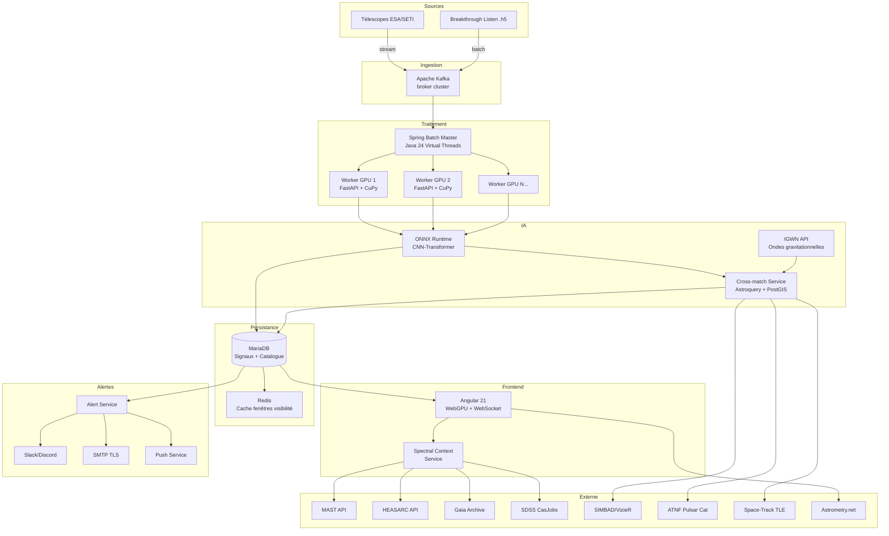
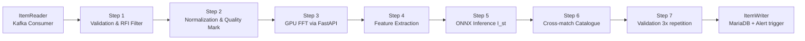
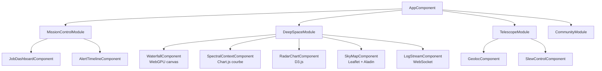
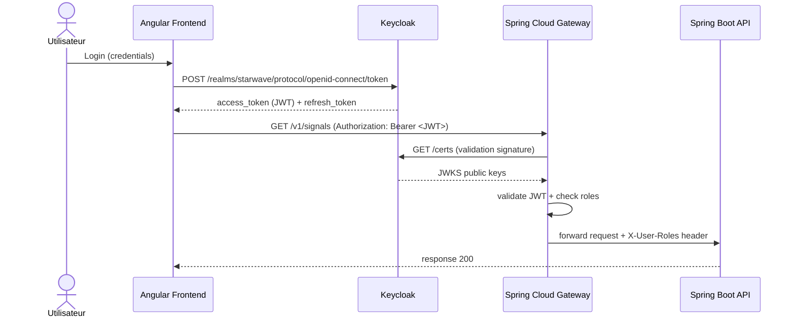

# ⚙️ Spécifications Techniques — S.T.A.R.W.A.V.E.

## SETI Tracking & Analysis of Radio Waves for ESA

---

## Sommaire

1. [Architecture générale](#1-architecture-générale)
2. [Composants backend](#2-composants-backend)
3. [Pipeline de traitement du signal](#3-pipeline-de-traitement-du-signal)
4. [Module IA & inférence](#4-module-ia--inférence)
5. [Interface utilisateur (Frontend)](#5-interface-utilisateur-frontend)
6. [APIs & contrats d'interface](#6-apis--contrats-dinterface)
7. [Modèle de données](#7-modèle-de-données)
8. [Sécurité](#8-sécurité)
9. [Observabilité](#9-observabilité)
10. [Performances & contraintes non-fonctionnelles](#10-performances--contraintes-non-fonctionnelles)

---

## 1. Architecture Générale

### 1.1 Vue d'ensemble



### 1.2 Choix d'architecture

L'architecture adopte un pattern **event-driven + batch hybride** :

- **Ingestion :** Apache Kafka pour découpler les sources des traitements et absorber les pics de flux.
- **Traitement :** Spring Batch 5.x avec partitioning Master/Worker — chaque worker traite une partition de fréquences indépendamment.
- **IA :** modèles ONNX embarqués dans la JVM via Spring AI pour les inférences légères (<2 ms) ; calculs FFT lourds déportés sur GPU via FastAPI/CuPy.
- **Frontend :** Angular 21 avec Signals pour la réactivité fine ; WebGPU pour le rendu Waterfall haute performance.
- **Communication temps réel :** WebSocket STOMP pour le push des frames vers le frontend.

---

## 2. Composants Backend

### 2.1 Spring Boot Application (Core)

**Version :** Spring Boot 3.4.5 / Java 24
**Spring Cloud :** 2024.0.1
**Spring AI :** 1.0.0

| Module Spring | Usage |
|---|---|
| `spring-batch` | Orchestration pipeline traitement signal |
| `spring-messaging` + `spring-websocket` | Push frames WebSocket STOMP |
| `spring-hateoas` | Ressources auto-descriptives REST |
| `spring-security` (OAuth2 Resource Server) | Validation JWT Keycloak |
| `spring-ai` | Intégration ONNX Runtime en JVM |
| `spring-cloud-gateway` | Rate-limiting, routage, auth centralisée — module **gateway/** dédié (WebFlux) |
| `micrometer-registry-prometheus` | Export métriques Prometheus |

**Virtual Threads (Project Loom) :** activé via `spring.threads.virtual.enabled=true` pour maximiser la concurrence des steps Batch sans saturer le pool de threads OS.

> ⚠️ `spring-cloud-gateway` est déployé dans le module `gateway/` séparé (stack WebFlux/Netty). Le module `backend/` utilise exclusivement la stack Spring MVC/Tomcat.

### 2.2 FastAPI GPU Worker

**Stack :** Python 3.12 / FastAPI / CuPy / NumPy / SciPy  
**Endpoints exposés :**

```
POST /compute/fft          → FFT d'une trame brute, retourne spectrogramme
POST /compute/drift        → Hough inversée Deep-Drift (détection glissement Doppler)
POST /compute/features     → Extraction features (SNR, compressibilité LZMA2, QPO)
GET  /health               → Healthcheck GPU + CUDA
```

**Déploiement :** conteneur NVIDIA CUDA 12.x, accès GPU via `--gpus=all` ou device plugin Kubernetes.

### 2.3 Cross-match & Catalogue Service

**Stack :** Python / Astroquery / PostGIS / MOC (Multi-Order Coverage)

- Charge les catalogues ATNF, FRBcat, SIMBAD en base PostGIS avec indexation spatiale (GIST sur colonne `geometry`).
- Requêtes cone-search optimisées via `ST_DWithin` + index HEALPix.
- Cache Redis (TTL 1h) pour les résultats de cross-match récurrents sur les mêmes coordonnées.

### 2.4 Spectral Context Service

**Stack :** Python / Astroquery / requests  
**Flux :** reçoit (ra, dec, radius) → interroge en parallèle MAST (SSAP), HEASARC (HAPI), Gaia (TAP), SDSS (CasJobs) → normalise les réponses FITS → retourne un payload unifié JSON.

```python
# Interface du service
async def query_spectrum(ra: float, dec: float, radius_deg: float = 0.05) -> SpectrumPayload:
    results = await asyncio.gather(
        query_mast(ra, dec, radius_deg),
        query_heasarc(ra, dec, radius_deg),
        query_gaia(ra, dec, radius_deg),
        query_sdss(ra, dec, radius_deg),
    )
    return merge_and_normalize(results)
```

---

## 3. Pipeline de Traitement du Signal

### 3.1 Étapes Spring Batch



### 3.2 Partitioning Master/Worker

- Le **Master Step** découpe l'espace des fréquences en N partitions (ex : 1420–1422 MHz → 10 tranches de 0,2 MHz).
- Chaque **Worker Step** est un pod Kubernetes séparé avec accès GPU propre.
- La reprise sur incident utilise `JobRepository` (table `BATCH_STEP_EXECUTION` en MariaDB) : redémarrage au dernier `stepId` en échec.

### 3.3 Calcul de l'Indice $I_{st}$

```
I_st = w1 * SNR_norm
     + w2 * NarrowBand_score       // bande < 1 Hz → probable artificiel
     + w3 * Doppler_regularity     // dérive linéaire = mouvement orbital
     + w4 * (1 - Compressibility)  // LZMA2 ratio : signal structuré
     + w5 * Repetition_score       // périodicité mathématique
     + w6 * CrossMatch_penalty     // -1 si Explained par catalogue

avec Σ(wi) = 1, seuil alerte : I_st > 0.95
```

Les poids $w_i$ sont configurables par un Commander et versionnés en base pour audit.

---

## 4. Module IA & Inférence

### 4.1 Architecture du modèle

**Architecture hybride CNN-Transformer (export ONNX) :**

```
Input: spectrogramme [time × freq × 1]
    │
    ├── CNN Branch (patterns visuels)
    │   Conv2D(32) → BatchNorm → ReLU
    │   Conv2D(64) → BatchNorm → ReLU → MaxPool
    │   Conv2D(128) → GlobalAvgPool
    │
    ├── Transformer Branch (séquences temporelles)
    │   Embedding(freq_features, d=256)
    │   MultiHeadAttention(heads=8)
    │   FeedForward → LayerNorm
    │
    └── Fusion MLP
        Concat[CNN_out, Transformer_out]
        Dense(256) → Dropout(0.3) → Dense(3)
        Softmax → {Alpha, Beta, Omega}

Output: {class, confidence, I_st_components[]}
```

### 4.2 Entraînement & réentraînement

- Dataset initial : Breakthrough Listen Open Data + signaux SETI@Home labellisés + RFI synthétiques (Setigen).
- Réentraînement déclenché par accumulation de 500 corrections utilisateur (feedback US-34).
- Pipeline MLOps : PyTorch → export ONNX → versioning modèle en S3/MinIO → hot-swap sans redémarrage via Spring AI.

### 4.3 Explicabilité (XAI)

- **SHAP values** calculées post-inférence pour les 6 features de $I_{st}$.
- Exposées via `GET /signals/{id}/explain` → payload `{feature, weight, contribution}[]`.
- Rendu dans le panneau "Pourquoi ce score ?" de l'IHM.

---

## 5. Interface Utilisateur (Frontend)

### 5.1 Stack Angular 21

| Technologie | Usage |
|---|---|
| Angular 21 Signals | Réactivité fine sans re-rendus inutiles |
| WebGPU (canvas API) | Rendu Waterfall 60 fps (millions de points/sec) |
| WebSocket STOMP (`@stomp/stompjs`) | Réception frames temps réel |
| Leaflet + Aladin Lite v3 | Carte du ciel interactive |
| Chart.js / D3.js | Radar Chart, courbes spectrales |
| Service Workers | Push notifications, cache offline |

### 5.2 Architecture Angular



### 5.3 Rendu Waterfall WebGPU

Le Waterfall utilise un **compute shader** WGSL pour le mapping intensité → couleur :

```wgsl
@compute @workgroup_size(64)
fn main(@builtin(global_invocation_id) gid: vec3<u32>) {
    let freq_idx = gid.x;
    let amplitude = spectrogramBuffer[gid.y * FREQ_BINS + freq_idx];
    let color = colormap_viridis(amplitude / MAX_AMPLITUDE);
    outputTexture[gid.y][freq_idx] = color;
}
```

---

## 6. APIs & Contrats d'Interface

### 6.1 API REST (HATEOAS)

**Base URL :** `https://api.starwave.esa.int/v1`  
**Auth :** Bearer JWT (Keycloak)

```
# Signaux
GET    /signals                          → liste paginée avec filtres
GET    /signals/{id}                     → détail + _links HATEOAS
POST   /signals/{id}/reanalyze           → relancer l'analyse IA
POST   /signals/{id}/archive             → archiver le signal
GET    /signals/{id}/spectrum            → spectre multi-longueur d'onde
GET    /signals/{id}/spectrum/export     → export FITS
GET    /signals/{id}/explain             → SHAP values I_st
POST   /signals/{id}/generate-report     → PDF certifié
POST   /signals/{id}/acknowledge         → accuser réception alerte

# Jobs Batch
POST   /jobs/start                       → démarrer un job
POST   /jobs/{id}/pause                  → mettre en pause
POST   /jobs/{id}/stop                   → arrêter
POST   /jobs/{id}/restart                → reprendre depuis step en échec
GET    /jobs/{id}/status                 → statut courant

# Géolocalisation
GET    /signals?lat={}&lon={}&visible=true&min_elev={}&start={}&end={}

# Télescope
POST   /telescope/slew                   → envoyer RA/Dec au mount
GET    /telescope/telemetry              → télémétrie temps réel
POST   /telescope/plate-solve            → lancer plate-solve

# Catalogue
GET    /catalogue/crossmatch?ra={}&dec={}&radius={}
GET    /catalogue/objects/{id}           → fiche objet catalogue

# Communauté
GET    /community/hall-of-fame           → signaux publiés
POST   /community/signals/{id}/vote      → voter pour naming
```

### 6.2 WebSocket (STOMP)

**Broker :** Spring WebSocket avec SockJS fallback

| Topic | Direction | Contenu |
|---|---|---|
| `/topic/waterfall` | Server → Client | Frames FFT (Float32Array, freq×time) |
| `/topic/alerts` | Server → Client | Alertes temps réel (signalId, I_st, type) |
| `/topic/jobs/{id}` | Server → Client | Mises à jour statut job batch |
| `/topic/telemetry` | Server → Client | Az, Alt, erreur arcsec du mount |
| `/app/replay` | Client → Server | Demande de replay (start, end, speed) |

### 6.3 Réponse HATEOAS — Exemple `GET /signals/{id}`

```json
{
  "id": "sig-042",
  "frequency_mhz": 1420.4,
  "timestamp": "2026-03-21T22:14:05Z",
  "ra": 142.345,
  "dec": -1.234,
  "i_st": 0.97,
  "classification": "Omega",
  "label": "Unexplained",
  "confirmed": true,
  "_links": {
    "self":            { "href": "/v1/signals/sig-042" },
    "reanalyze":       { "href": "/v1/signals/sig-042/reanalyze", "method": "POST" },
    "archive":         { "href": "/v1/signals/sig-042/archive",   "method": "POST" },
    "view-on-sky-map": { "href": "/v1/signals/sig-042/skymap" },
    "spectrum":        { "href": "/v1/signals/sig-042/spectrum" },
    "explain":         { "href": "/v1/signals/sig-042/explain" },
    "generate-report": { "href": "/v1/signals/sig-042/generate-report", "method": "POST" }
  }
}
```

---

## 7. Modèle de Données

### 7.1 Schéma principal (MariaDB)

```sql
-- Signaux candidats
CREATE TABLE signal (
    id              VARCHAR(36)    PRIMARY KEY,
    frequency_mhz   DECIMAL(12,6)  NOT NULL,
    timestamp_utc   DATETIME(6)    NOT NULL,
    ra              DECIMAL(10,6),
    dec             DECIMAL(10,6),
    snr             FLOAT,
    bandwidth_hz    FLOAT,
    doppler_drift   FLOAT,
    compressibility FLOAT,
    i_st            FLOAT          NOT NULL,
    classification  ENUM('Alpha','Beta','Omega') NOT NULL,
    label           VARCHAR(100),             -- ex: 'Explained: Pulsar (ATNF J0437)'
    confirmed       BOOLEAN        DEFAULT FALSE,
    detection_count TINYINT        DEFAULT 1,
    status          ENUM('CANDIDATE','CONFIRMED','ARCHIVED','EXPLAINED') DEFAULT 'CANDIDATE',
    created_at      DATETIME(6)    DEFAULT NOW(6),
    INDEX idx_i_st (i_st),
    INDEX idx_timestamp (timestamp_utc),
    SPATIAL INDEX idx_coords (ra, dec)  -- via generated column geometry
);

-- Provenance catalogue
CREATE TABLE signal_provenance (
    id              BIGINT AUTO_INCREMENT PRIMARY KEY,
    signal_id       VARCHAR(36)    NOT NULL REFERENCES signal(id),
    catalogue       VARCHAR(50)    NOT NULL,  -- ATNF, SIMBAD, FRBCAT, TLE, IGWN
    catalogue_id    VARCHAR(100),
    separation_deg  FLOAT,
    confidence      ENUM('CERTAIN','PROBABLE','POSSIBLE'),
    dm_concordant   BOOLEAN,
    period_concordant BOOLEAN,
    catalogue_version VARCHAR(50),
    matched_at      DATETIME(6)    DEFAULT NOW(6)
);

-- Historique détections (pour règle RG-05)
CREATE TABLE signal_detection (
    id              BIGINT AUTO_INCREMENT PRIMARY KEY,
    signal_id       VARCHAR(36)    NOT NULL REFERENCES signal(id),
    detected_at     DATETIME(6)    NOT NULL,
    i_st_snapshot   FLOAT,
    source          VARCHAR(100)   -- télescope / batch job id
);

-- Alertes
CREATE TABLE alert (
    id              VARCHAR(36)    PRIMARY KEY,
    signal_id       VARCHAR(36)    NOT NULL REFERENCES signal(id),
    type            ENUM('PREMIER_CONTACT','CANDIDATE','CHAOS_TEST'),
    status          ENUM('OPEN','ACKNOWLEDGED','CLOSED'),
    acknowledged_by VARCHAR(100),
    acknowledged_at DATETIME(6),
    created_at      DATETIME(6)    DEFAULT NOW(6)
);

-- Jobs Batch (en plus des tables Spring Batch natives)
CREATE TABLE job_run (
    id              VARCHAR(36)    PRIMARY KEY,
    job_name        VARCHAR(100),
    status          ENUM('RUNNING','PAUSED','FAILED','COMPLETED'),
    freq_range_start DECIMAL(12,6),
    freq_range_end   DECIMAL(12,6),
    started_at      DATETIME(6),
    ended_at        DATETIME(6),
    signals_processed INT DEFAULT 0,
    signals_candidate INT DEFAULT 0
);

-- Poids I_st (versionnés)
CREATE TABLE ist_weights (
    version         INT            PRIMARY KEY AUTO_INCREMENT,
    w_snr           FLOAT NOT NULL DEFAULT 0.20,
    w_narrow_band   FLOAT NOT NULL DEFAULT 0.25,
    w_doppler       FLOAT NOT NULL DEFAULT 0.20,
    w_compress      FLOAT NOT NULL DEFAULT 0.20,
    w_repetition    FLOAT NOT NULL DEFAULT 0.15,
    w_crossmatch    FLOAT NOT NULL DEFAULT -1.0,
    created_by      VARCHAR(100),
    created_at      DATETIME(6)    DEFAULT NOW(6),
    active          BOOLEAN        DEFAULT FALSE
);
```

### 7.2 Indexation spatiale PostGIS (cross-match)

```sql
-- Catalogue objets connus (PostGIS)
CREATE TABLE catalogue_object (
    id              BIGINT AUTO_INCREMENT PRIMARY KEY,
    catalogue       VARCHAR(50),
    catalogue_id    VARCHAR(100),
    object_type     VARCHAR(50),   -- Pulsar, FRB, AGN, Satellite, BHC...
    coords          GEOMETRY(POINT, 4326),  -- RA/Dec en WGS84
    period_ms       FLOAT,         -- Pulsars
    dm              FLOAT,         -- FRBs
    redshift        FLOAT,         -- AGN/Quasars
    tle_epoch       DATETIME,      -- Satellites
    last_updated    DATETIME(6),
    SPATIAL INDEX idx_coords (coords)
);
```

---

## 8. Sécurité

### 8.1 Authentification & Autorisation



### 8.2 Rôles Keycloak

| Rôle Keycloak | Endpoints autorisés |
|---|---|
| `ROLE_EXPLORER` | GET /signals/*, GET /spectrum/*, POST /telescope/slew |
| `ROLE_ANALYST` | + POST /signals/*/reanalyze, POST /generate-report, GET /explain |
| `ROLE_COMMANDER` | + POST /jobs/*, POST /signals/*/acknowledge, DELETE /signals/* |
| `ROLE_ADMIN` | Tout + /actuator/*, /admin/* |

### 8.3 Rate Limiting (Spring Cloud Gateway)

```yaml
spring.cloud.gateway.routes:
  - id: jobs-api
    predicates: [ Path=/v1/jobs/** ]
    filters:
      - name: RequestRateLimiter
        args:
          redis-rate-limiter.replenishRate: 5
          redis-rate-limiter.burstCapacity: 10
          key-resolver: "#{@userKeyResolver}"
```

### 8.4 Secrets Management

Tous les secrets (clés API NASA/ESA/IGWN, credentials DB, tokens Keycloak, clé privée signature PDF) sont stockés dans **HashiCorp Vault** et injectés en environnement via le Vault Agent Injector Kubernetes.

---

## 9. Observabilité

### 9.1 Métriques Micrometer → Prometheus

| Métrique | Type | Description |
|---|---|---|
| `starwave.batch.job.duration` | Histogram | Durée d'exécution d'un job complet |
| `starwave.batch.step.errors` | Counter | Nombre d'échecs par step |
| `starwave.signal.candidates.total` | Counter | Signaux candidats créés |
| `starwave.signal.ist.histogram` | Histogram | Distribution des scores I_st |
| `starwave.ai.inference.latency` | Histogram | Latence inférence ONNX (ms) |
| `starwave.crossmatch.duration` | Histogram | Durée service cross-match |
| `starwave.alerts.fired` | Counter | Alertes Premier Contact déclenchées |
| `starwave.websocket.connections` | Gauge | Clients WebSocket connectés |
| `starwave.gpu.utilization` | Gauge | Utilisation GPU (via DCGM exporter) |

### 9.2 Dashboards Grafana

Trois dashboards prédéfinis :

- **Operations** : jobs en cours, taux d'erreur, latences, GPU.
- **Science** : distribution $I_{st}$, signaux candidats/heure, Fermi Score historique.
- **Alertes** : timeline des alertes Premier Contact, temps moyen d'acknowledgement.

### 9.3 Logging (structuré JSON)

Stack : SLF4J + Logback → JSON structuré → Loki → Grafana.  
Chaque log inclut : `traceId`, `spanId`, `jobId`, `signalId`, `userId`, `role`.

---

## 10. Performances & Contraintes Non-Fonctionnelles

| Contrainte | Valeur cible | Mécanisme |
|---|---|---|
| Traitement 1 To de données radio | < 60 minutes | Spring Batch partitioning + GPU workers |
| Latence inférence ONNX | < 2 ms par signal | Spring AI ONNX Runtime in-JVM |
| Faux positifs IA (Pulsars) | < 5 % | Modèle CNN-Transformer + règle RG-05 |
| Disponibilité système monitoring | 99,9 % | K8s health probes + PodDisruptionBudget |
| Délai alerte Premier Contact | < 5 secondes | Rules Engine synchrone post-INSERT |
| Débit WebSocket Waterfall | 60 fps | WebGPU compute shader côté client |
| Latence Spectral Context | < 3 secondes | Requêtes parallèles async + cache Redis |
| Temps de slew confirmation | < 30 secondes | Télémétrie temps réel + plate-solve pipeline |
| Reprise sur incident batch | < 2 minutes | Restart Spring Batch depuis `stepId` en échec |

---

*Fin du document technique — S.T.A.R.W.A.V.E. v1.1*
